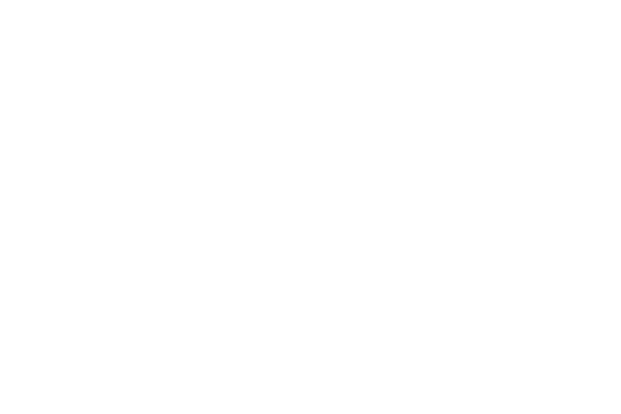

# PCarts - The PC Cartridge System

### A media cartridge system for PC using microSD cards to physicalize your digital media collection.
This cartridge system turns microSD cards into "full-size" media cartridges for PC that you can display on a shelf. Just put a microSD card into a PCart, then load the cartridge into a PCart reader connected to a PC (Windows/Mac/Linux). It currently supports High Speed USB 2.0 (480 Mbps transfer speed), and SD, SDHC, and SDXC microSD cards. The cartridges can be formated to any SD card compatible filesystem. The cartridge reader is recognized by the computer as a typical SD card reader peripheral, and the cartridges behave like any ordinary SD card.

## What’s in this repo?
- /docs: contains documentation, schematics, and instructions
- /pcbs: contains all pcb files needed to purchase or modify the pcbs used in the project. The pcb source files are compatible with EasyEDA Pro <https://pro.easyeda.com/editor> (free cloud software)
- /stls: contains 3D CAD and object files for printing enclosures

## How to order/build it
You can order the PCBs online from a number of sites and even have them assemble the boards for you. If you do not choose PCB Assembly when ordering the boards, you will have to solder on 0603-sized components by hand at home. This is not recommended if you do not have the necessary tools like a hot plate or hot air rework station and the necessary experience with small components. **DIY assembly of this hardware is not considered a beginner friendly project.**

I manufactured my boards with JLCPCB <https://jlcpcb.com/>, but PCBWay <https://www.pcbway.com/> should work just as well. I only specifically designed these boards with those two manufacturers in mind, so I cannot guarantee compatibility with any other manufacturer.

After uploading the Gerber, BOM, and Pick-and-Place files, JLCPCB can be a bit buggy and sometimes insist they can't find a part even if it's in stock. If this happens, click the Search button and type in the manufacturer or supplier part number from the BOM, then click select. If the component really is out of stock, you will need to locate a comparable replacement.

**Note: Some assembly is required even if you pay for a PCB assembly service, but it isn't too hard. You will need to separately purchase and solder on the 50-pin cartridge connectors to the reader boards after receiving your PCBs from the manufacturer. This can be done well even with minimal soldering experience and a cheap soldering iron. If you cannot do this or have someone you know do this for you, please do not attempt to purchase these PCBs. This connector is absolutely critical.**

### Reader board ordering notes
Ensure the following selections are made when ordering these boards online:
- Layers: 4 (specify JLC04161H-7628 stackup for JLCPCB)
- PCB Thickness: 1.6mm
- All other settings should be default

### Cartridge board ordering notes
Ensure the following selections are made when ordering these boards online:
- Layers: 4 (specify JLC04121H-7628 stackup for JLCPCB)
- PCB Thickness: 1.2mm
- Surface Finish: ENIG
- Gold Fingers (Edge connector): Yes, 30 degree bevel
- All other settings should be default

### Required Bill-of-Materials
The following components will need to be purchased separately even if you pay for PCB Assembly.

| Quantity | Part                                            | Link                                                                                  |
| ----------| -------------------------------------------------| ---------------------------------------------------------------------------------------|
| 5        | 2.54mm pitch 50-pin (2x25) card edge connectors | [AliExpress](https://www.aliexpress.us/item/3256802817047324.html)                    |
| 1        | Set of m2.5 round-head screws                   | [Amazon](https://www.amazon.com/KADRICK-1000PCS-Socket-Button-4MM-20MM/dp/B0DRCCSSB7) |
| 1        | Set of m2.5 heat set inserts                    | [Amazon](https://www.amazon.com/dp/B0CS6YVJYD)                                        |
| 5        | UHS-I Class 10 microSD card                     | Anywhere                                                                              |

### DIY Bill-of-Materials
Below is the minimum order for components you'll need if you are assembling the boards yourself. This is intended for the minimum 5 cartridges and 5 readers order, but this BOM will accomodate more than that. Component quantity is based on supplier minimum order restrictions at the time of this writing.

| Quantity | Comment                               | Manuf. Part Num.    | Supplier Part Num. | Supplier |
| ----------| ---------------------------------------| ---------------------| --------------------| ----------|
| 50       | 10uF ceramic capacitor                | CL10A106MQ8NNNC     | C1691              | LCSC     |
| 20       | 4.7uF ±10% 16V Ceramic Capacitor      | TCC0603X5R475K160CT | C380325            | LCSC     |
| 100      | 100nF ceramic capacitor               | CL10B104KB8NNNC     | C1591              | LCSC     |
| 20       | 12V 6A ESD Diode SOT-23-6             | USBLC6-2SC6         | C2827654           | LCSC     |
| 10       | USB to SD 480Mbps USB 2.0             | GL823K-HCY04        | C284879            | LCSC     |
| 100      | Red 625nm LED Indicator               | XL-1608SURC-06      | XL-1608SURC-06     | LCSC     |
| 100      | RES 330Ω ±1% 100mW 0603 Chip Resistor | FRC0603F3300TS      | C2933198           | LCSC     |
| 100      | 5.1kΩ 0603 Chip Resistor              | FRC0603J512 TS      | C2907114           | LCSC     |
| 100      | 4 ±5% 47kΩ Resistor Array             | EXB-38V473JV        | C1731274           | LCSC     |
| 10       | Micro SD card connector Push-Push     | TF-CARD H1.8        | C7529389           | LCSC     |
| 10       | USB 2.0 Type-C Connector              | PTCFW-H22A-115      | C54829816          | LCSC     |

## Labels
There is space on the front and top of the cartridge shells for labels exactly 3" wide and about 2" tall. There are many ways you can make or order these yourself. I will be using a KODAK Zink sticker printer to print at home: <https://www.amazon.com/dp/B08C72V1LB>

## Compatibility and Usage
PCarts are known to be compatible with Windows and Linux. Apple Mac computers have not been tested but should be compatible. PCarts can be used as general-purpose USB flashdrives to store any data, or for more specific gaming use cases. For more information on compatibility and usage, please [check the wiki](https://github.com/carlgoshert/PC_Cartridge_System/wiki).

-----
Copyright Carl Goshert 2026.

This source describes Open Hardware and is licensed under the CERN-OHL-P v2.

You may redistribute and modify this documentation and make products using it under the terms of the CERN-OHL-P v2 (https:/cern.ch/cern-ohl). This documentation is distributed WITHOUT ANY EXPRESS OR IMPLIED WARRANTY, INCLUDING OF MERCHANTABILITY, SATISFACTORY QUALITY AND FITNESS FOR A PARTICULAR PURPOSE. Please see the CERN-OHL-P v2 for applicable conditions.
