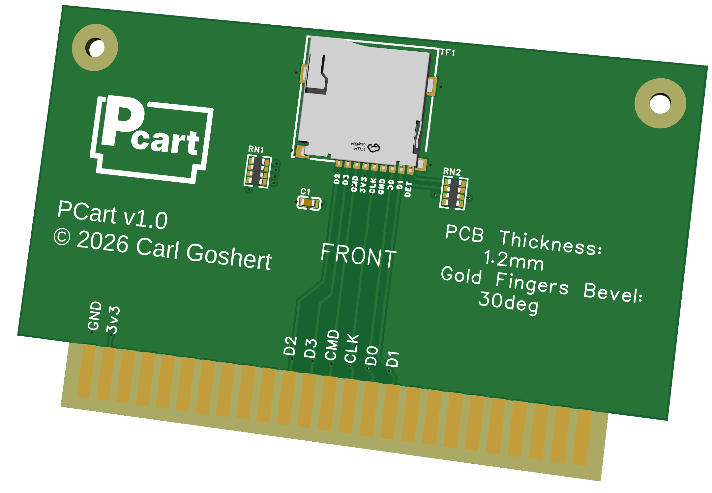
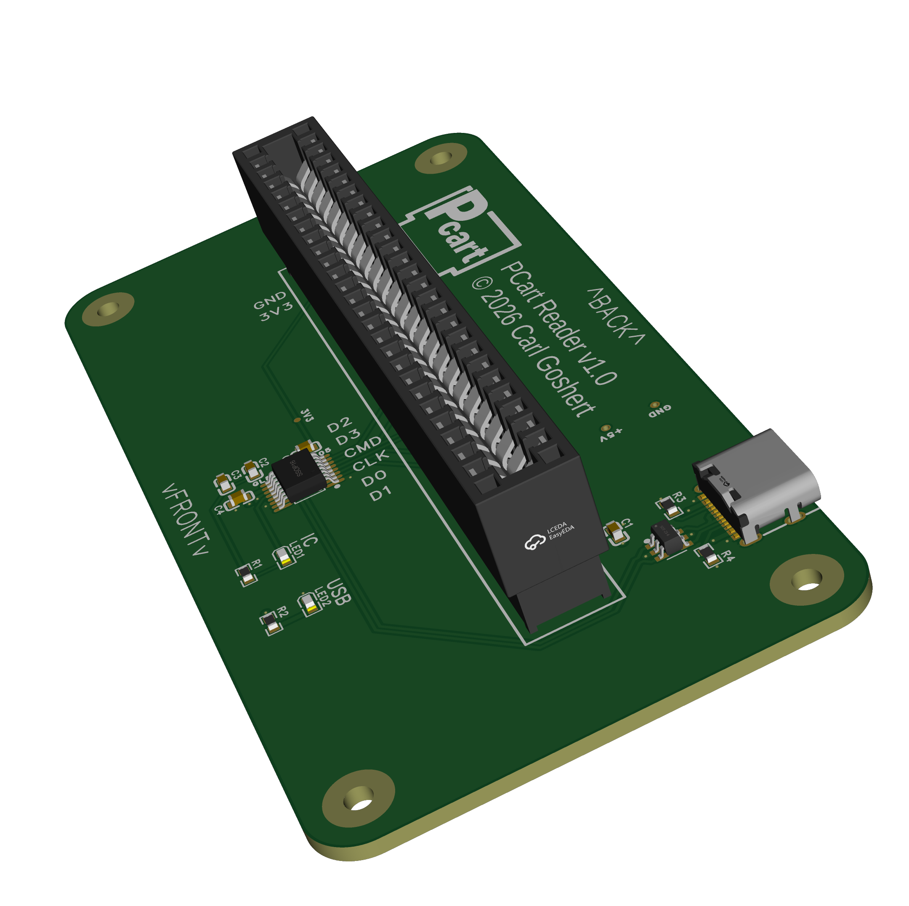

# PCarts - The PC Cartridge System

### A media cartridge system for PC using microSD cards to physicalize your digital media collection.
This cartridge system turns microSD cards into "full-size" media cartridges for PC that you can display on a shelf. Just put a microSD card into a PCart, then load the cartridge into a PCart reader connected to a PC (Windows/Mac/Linux). It currently supports High Speed USB 2.0 (480 Mbps transfer speed), and SD, SDHC, and SDXC microSD cards. The cartridges can be formated to any SD card compatible filesystem. The cartridge reader is recognized by the computer as a typical SD card reader peripheral, and the cartridges behave like any ordinary SD card.

## What’s in this repo?
- /docs: contains documentation, schematics, and instructions
- /pcbs: contains all pcb files needed to purchase or modify the pcbs used in the project. The pcb source files are compatible with EasyEDA Pro <https://pro.easyeda.com/editor> (free cloud software)
- /stls: contains stl and slicer files for 3D printing shells and accessories

## How to order/build it
You can order the PCBs online from a number of sites and even have them assemble the boards for you. If you do not choose PCB Assembly when ordering the boards, you will have to solder on 0603-sized components by hand at home. This is not recommended if you do not have the necessary tools like a hot plate or hot air rework station and the necessary experience with small components. **DIY assembly of this hardware is not considered a beginner friendly project.**

I manufactured my boards with JLCPCB <https://jlcpcb.com/>, but PCBWay <https://www.pcbway.com/> should work just as well. I only specifically designed these boards with those two manufacturers in mind, so I cannot guarantee compatibility with any other manufacturer.

After uploading the Gerber, BOM, and Pick-and-Place files, JLCPCB can be a bit buggy and sometimes insist they can't find a part even if it's in stock. If this happens, click the Search button and type in the manufacturer or supplier part number from the BOM, then click select. If the component really is out of stock, you will need to locate a comprable replacement.

### Cartridge board ordering notes
Ensure the following selections are made when ordering these boards online:
- Layers: 4 (specify JLC04121H-7628 stackup for JLCPCB)
- PCB Thickness: 1.2mm
- Surface Finish: ENIG
- Gold Fingers (Edge connector): Yes, 30 degree bevel
- All other settings should be default

### Reader board ordering notes
Ensure the following selections are made when ordering these boards online:
- Layers: 4 (specify JLC04161H-7628 stackup for JLCPCB)
- PCB Thickness: 1.6mm
- All other settings should be default

### DIY Bill-of-Materials
Below is the minimum order for components you'll need if you are assembling the boards yourself. This is intended for the minimum 5 cartridges and 5 readers order, but this BOM will accomodate more than that. Component quantity is based on supplier minimum order restrictions at the time of this writing.

| Quantity | Comment                   | Manuf. Part Num. | Supplier Part Num. | Supplier |
|----------|---------------------------|------------------|--------------------|----------|
| 50       | 10uF ceramic capacitor    | CL10A106MQ8NNNC  | C1691              | LCSC     |
| 20       | 4.7uF ±10% 16V Ceramic Capacitor | TCC0603X5R475K160CT | C380325  | LCSC     |
| 100      | 100nF ceramic capacitor   | CL10B104KB8NNNC  | C1591              | LCSC     |
| 20       | 12V 6A ESD Diode SOT-23-6 | USBLC6-2SC6      | C2827654           | LCSC     |
| 10       | USB to SD 480Mbps USB 2.0 | GL823K-HCY04     | C284879            | LCSC     |
| 100      | Red 625nm LED Indicator   | XL-1608SURC-06   | XL-1608SURC-06     | LCSC     |
| 100      | RES 330Ω ±1% 100mW 0603 Chip Resistor | FRC0603F3300TS | C2933198 | LCSC     |
| 100      | 5.1kΩ 0603 Chip Resistor  | FRC0603J512 TS   | C2907114           | LCSC     |
| 100      | 4 ±5% 47kΩ Resistor Array | EXB-38V473JV     | C1731274           | LCSC     |
| 10       | Micro SD card connector Push-Push | TF-CARD H1.8 | C7529389       | LCSC     |
| 10       | USB 2.0 Type-C Connector | PTCFW-H22A-115    | C54829816          | LCSC     |

Due to low supply and/or compatibility, you will need to source the following components separately:
- [5] 2.54mm pitch 50 pin (2x25) card edge connectors <https://www.aliexpress.us/item/3256802817047324.html?spm=a2g0o.order_list.order_list_main.9.21ef1802FdSqNg&gatewayAdapt=glo2usa>
- [5] microSD cards, UHS-I Class 10, 32GB or greater <https://www.microcenter.com/product/705002/verbatim-64gb-premium-microsdxc-class-10-uhs-1-flash-memory-card-with-adapter>
- The 3D prints are designed to use these m2.5 heat set inserts <https://www.amazon.com/dp/B0CS6YVJYD>
- You will also need round-head m2.5 screws, like these <https://www.amazon.com/KADRICK-1000PCS-Socket-Button-4MM-20MM/dp/B0DRCCSSB7>

## Labels
There is space on the front and top of the cartridge shells for labels exactly 3" wide and about 2" tall. There are many ways you can make or order these yourself. I will be using a KODAK Zink sticker printer to print at home: <https://www.amazon.com/dp/B08C72V1LB>

## Compatibility and Usage
PCarts are known to be compatible with Windows and Linux. Apple Mac computers have not been tested but should be compatible.

### Formatting
The microSD cards can be formatted to your required filesystem before *or* after being inserted into a PCart.
- Windows/Mac: Please refer to this WikiHow guide for formatting the microSD cards <https://www.wikihow.com/Format-a-Micro-SD-Card> 
- Linux: Please refer to this guide for formatting the microSD cards <https://www.geeksforgeeks.org/linux-unix/how-to-format-usb-drives-on-linux/>

### Using with Kazeta
Kazeta is a cartridge-based gaming OS for PC <https://kazeta.org/>. It is a complete Linux operating system with retro-inspired features and runs any portable DRM-free software on specifically formated cartridges. Please see their website and Github Wiki for more details.

**Kazeta requires cartridges to be formated to the ext4 filesystem.** You may need Linux or a third-party Windows application to achieve this.
I recommend using the-outcaster's kzi generator from github <https://github.com/the-outcaster/kzi-cartridge-generator> for easily creating cartridge data for Kazeta.

### Using with Steam
LewdM3at created a script <https://github.com/LewdM3at/Steam-Games-Cartridges> for running Steam games off cartridges. It was originally intended for use with SSD's in an external Sata-USB adapter, but is compatible with the PCart system. Check out his Reddit post for more info: <https://www.reddit.com/r/pcmasterrace/comments/1ux13ui/steam_game_cartridges/>

### Using with RetroPie
You can use PCarts to hold one or more game roms, or the entire RetroPie installation.

To use as rom(s) cartridge:
1. Format the microSD card to Fat32 (may appear as vfat on Linux).
2. Copy all the contents of /home/pi/RetroPie into the root of the microSD card.
3. Place whichever roms or bios files you need into the appropriate folders on the microSD card.
4. In RetroPie, enter the RetroPie Setup and disable the optional package 'usbromservice'.
5. In RetroPie, add the following line to the bottom of /etc/fstab: `/dev/sda1  /home/pi/RetroPie   vfat    nofail,user,uid=pi,gid=pi   0   2`
    **Note: this may fail if you have any other USB flashdrive or NVME drive installed when the system boots**
6. Insert the PCart into the reader slot before turning on the system.
On boot, the system will automatically load the cartridge files into `/home/pi/RetroPie` and appear in the EmulationStation menu. **Note: This will hide any other files located at `/home/pi/RetroPie`, including files loaded over the network if using `/etc/fstab` to load files from a Samba share. You cannot map multiple sources to the same location as only one will appear.**

To use as a RetroPie system card:
1. Use the official Raspberry Pi Imager tool to format a microSD card with a RetroPie installation. Then place the card inside a PCart.
2. On Raspberry Pi 4 or 5, boot-from-USB is automatically supported. Either leave the microSD card slot on the Pi empty or edit the Pi's boot order priority so USB devices are booted first.
3. Insert the PCart into the reader slot before turning on the system.
From here, you can put all your roms and bios on the cartridge as well, or load them over the network.

-----
Copyright Carl Goshert 2026.

This source describes Open Hardware and is licensed under the CERN-OHL-P v2.

You may redistribute and modify this documentation and make products using it under the terms of the CERN-OHL-P v2 (https:/cern.ch/cern-ohl). This documentation is distributed WITHOUT ANY EXPRESS OR IMPLIED WARRANTY, INCLUDING OF MERCHANTABILITY, SATISFACTORY QUALITY AND FITNESS FOR A PARTICULAR PURPOSE. Please see the CERN-OHL-P v2 for applicable conditions.
